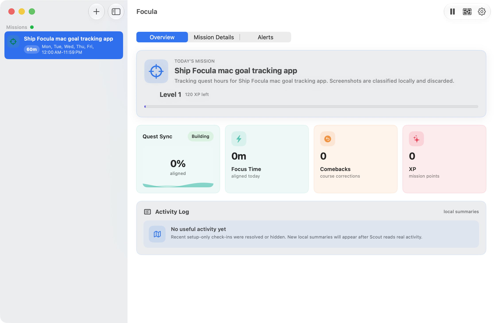
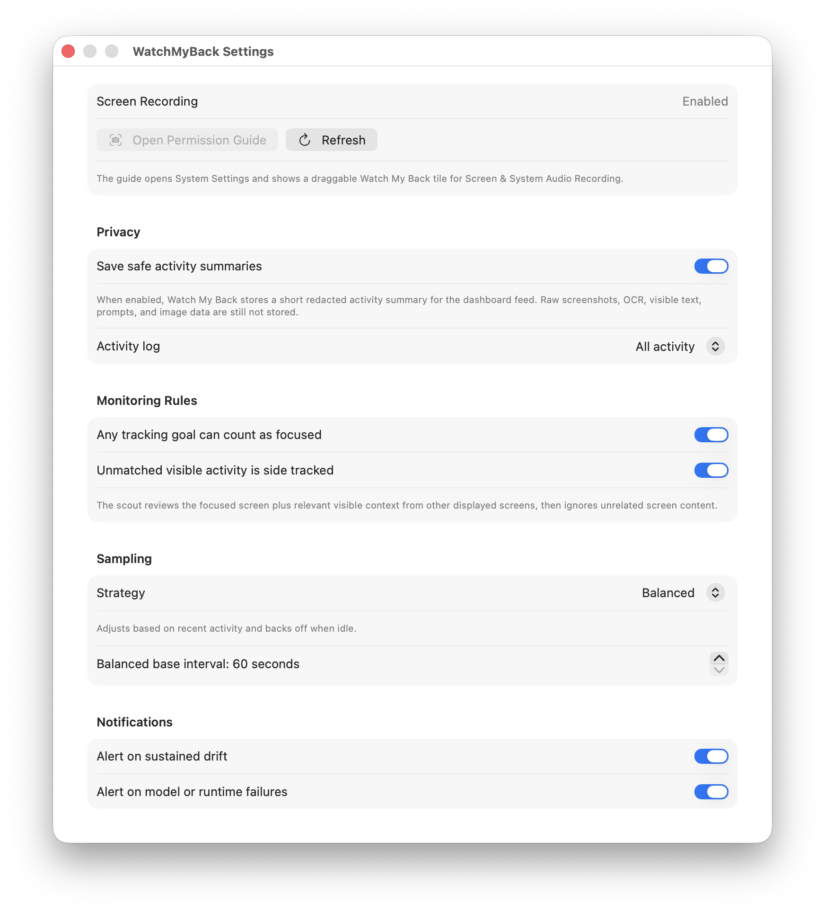

# Focula

Focula is a local-first macOS focus coach. It lets you define a few goals, watches frontmost app activity during focus hours, classifies ephemeral screenshots with a built-in local Gemma vision model, and nudges you when your work drifts off mission.

## Product spec

See [docs/product-spec.md](docs/product-spec.md) for the current product and implementation spec, including implemented areas, suspected gaps, and proposed roadmap slices.

## Screenshots





## Privacy model

- Screenshot frames are captured only for local classification.
- Raw screenshots, OCR text, and visible text are not stored in SQLite.
- Persisted records contain only metadata: app name, bundle id, goal id, focus state, category, confidence, duration, and whether a nudge was shown.
- Tracking is paused by default. Resume it from the dashboard or menu bar extra.
- Cloud model providers are blocked unless the user explicitly opts in to sending screenshots off-device.

## Built-in model

Default provider: `builtInGemma`.

The app manages a private runtime under Application Support and downloads the selected Gemma 4 E2B MLX vision model after the user clicks Install. Model weights are not committed to this repo. The Settings window and menu bar both include a built-in model picker plus an Open Models Folder action.

Built-in choices:

- `mlx-community/gemma-4-e2b-it-4bit` - recommended default, about 3.6 GB.
- `mlx-community/gemma-4-e2b-it-8bit` - higher precision, about 5.9 GB.
- `mlx-community/gemma-4-e2b-it-bf16` - largest local option, about 10.3 GB.
- `google/gemma-4-E2B-it-qat-mobile-transformers` - Google's smaller QAT mobile checkpoint, about 1 GB memory footprint, tracked in the app but not installable until the built-in sidecar supports LiteRT or Transformers mobile tensors.

Storage:

- Runtime path: `~/Library/Application Support/Focula/BuiltInRuntime`
- Model path: `~/Library/Application Support/Focula/BuiltInRuntime/Models`
- The main SQLite store is `~/Library/Application Support/Focula/focula.sqlite`.
- Existing development installs under `~/Library/Application Support/Watch My Back/watch-my-back.sqlite` are migrated on launch.
- Sidecar: app-owned loopback service at `127.0.0.1:8765` while the app is running

Older settings that pointed at `google/gemma-4-E2B-it` are migrated to the recommended MLX 4-bit built-in model. Settings lists installed model folders, including legacy folders such as `google__gemma-4-E2B-it`, and Delete removes only the folders the user selects.

The built-in sidecar is isolated behind `VisionClassifying`, so a native Swift MLX runtime can replace it later without changing UI or storage contracts.

## Optional providers

Settings and the menu bar model menu can switch to optional provider hooks:

- `oMLX`, when `omlx-cli` is already present.
- `lmStudio`, when `lms` is already present.
- `openAICompatible`, for manual local endpoints.
- `cloudOptIn`, blocked until the user enables screenshot egress.

Ollama is intentionally out of scope.

## Build and run

```bash
./script/build_and_run.sh
./script/build_and_run.sh --verify
```

The run script stages a normal app bundle at `dist/Focula.app`, copies SwiftPM resources, and signs the bundle. It uses the first available Apple Development identity by default; override with:

```bash
FOCULA_CODESIGN_IDENTITY="Apple Development: Name (TEAMID)" ./script/build_and_run.sh
```

If Screen Recording was granted to an older unsigned build, remove the old Focula row in System Settings, rebuild through the script, then use the in-app permission guide to grant the newly signed app.

Run tests:

```bash
rtk swift test
```

The app may request Notification permission and Screen & System Audio Recording permission when you resume tracking or manually sample.

## App icon

The source app icon is SVG-first so the design stays sharp before raster conversion:

- `Sources/Focula/Resources/AppIcon/FoculaAppIcon.svg`
- `Sources/Focula/Resources/AppIcon/Focula.icns`

The `.icns` file is generated from the SVG and wired into the staged app bundle as `CFBundleIconFile`.
